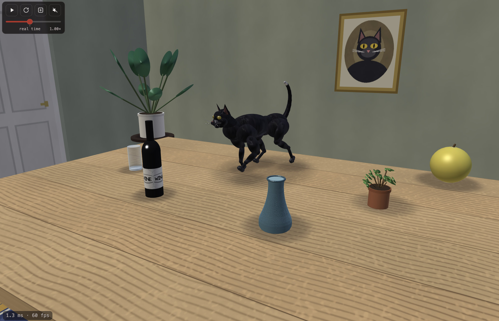

# Robo Cat vs Objects on Table

A simulated robo-cat that learns to clear a table.

**Marcel Padilla**, ETH Zürich

Robo cat doesn't like objects.

<a href="https://marcelpadilla.com/Projects/robo_cat/index.html"><picture>
  <source media="(prefers-color-scheme: dark)" srcset="assets/button-project-page-dark.png">
  
</picture></a>

Open [`index.html`](index.html) in a browser. It is one self-contained file: the
physics engine, the scene, the networks and the sounds are all inside it, so it needs
no server and no network, and it fills the window it is opened in.

## License

MIT, except the physics engine: the page embeds the MuJoCo WebAssembly build,
Apache 2.0, whose notice ships beside it in [`NOTICE.txt`](NOTICE.txt).
